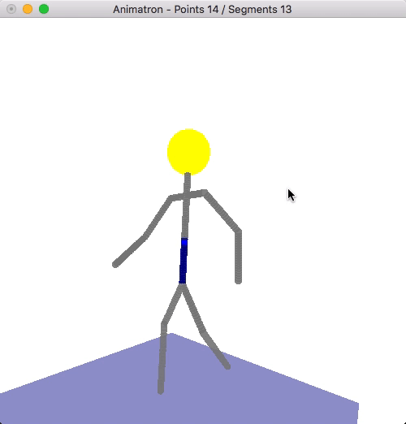

# opengl-animatron
OpenGL C++ Animated character control

## Features
* OpenGL-based application writtern in pure C++
* Uses a file-based format to build a body
* You can control body parts using keyboard

## Compiling

Run `make` from the command line

It will generate a binary executable for your platform:
* bin/macos/animatron-macos
* bin/windows/animatron-windows
* bin/linux/animatron-linux

### Linux dependencies

In debian/Ubuntu, install some development dependencies for OpenGL

```
sudo apt-get install mesa-common-dev libgl1-mesa-dev libglu1-mesa-dev freeglut3-dev
```

## Screenshot




